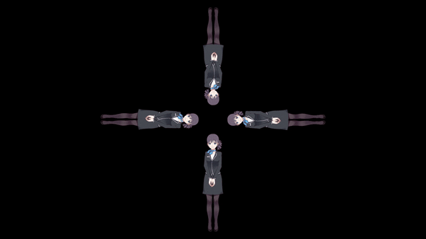

## Showcase


> Chat with a cute and live ChatGPT!


> This is the fullscreen holo mode. It is used to project the hologram using a pyramid!


> This is the actual hologram displayed using the pyramid! The expression is changing.

## Table of Content<a name="table-of-content"></a>

+ [TO-DO](#to-do)
+ [Introduction](#introduction)
	+ [Prerequisites](#prerequisites)
+ [Usage](#usage)
	+ [UI](#ui)
	+ [Settings](#settings)
	+ [Hologram](#hologram)
+ [Live2D Model](#live2d-model)
+ [Build and Deploy](#build-and-deploy)
	+ [Windows](#windows)
	+ [Linux](#linux)
+ [End Note](#end-note)

## TO-DO<a name="to-do"></a>
[Return to Table of Content](#table-of-content)

- [ ] Configure `.pro` file for compilation in Linux.
- [ ] Fix the bug in which the fullscreen doesn't automatically fill the screen with black background if the PC screen aspect ratio is 4:3.
- [ ] Add more models.


## Introduction<a name="introduction"></a>
[Return to Table of Content](#table-of-content)

The goal is to develop a ChatGPT-based Live2D chatbot with hologram display.

+ The development shall base on Qt6/C++, which is totally new to me.
+ The Live2D chatbot shall either dock on the screen as a standard Live2D widget, or display in the holographic mode on a hologram pyramid.
+ The Live2D chatbot shall support voice and keyboard interaction, with natural expressions and even body motions.

The workflow of the project is like follows.


> The input, should it be voice, will be converted to text by Azure. It is then combined to form the "messages" for OpenAI API format. The output from ChatGPT is in JSON format, containing three keys: "Expressions", "Motions", and "Content". The "Expressions" and "Motions" are used to animate the [Live2D](https://www.live2d.com/en/) model, and the "Content" will be voiced by Azure and also stitched to the "messages". The Live2D model can be duplicated by OpenCV for holographic display. The process Loops until the user terminates the talk session. The chat history is temporarily kept and will be read if user restart the chat or talk session, unless the user resets the history or closes the app. 

#### Prerequisites<a name="prerequisites"></a>
[Return to Table of Content](#table-of-content)

All the prerequisites are listed below.

If you directly download the release:

+ PC.
+ an [OpenAI API key](https://platform.openai.com/docs/introduction) for chatGPT calls and a [Microsoft Azure API key](https://learn.microsoft.com/en-us/azure/search/search-security-api-keys?tabs=portal-use%2Cportal-find%2Cportal-query) for speech-to-text and text-to-speech services. When you speak to the Live2D character, your words will be conversed to texts using Azure's speech-to-text API and sent to chatGPT. The latter's response will be sent to Azure's text-to-speech service so that the model can "speak".
+ A secondary screen, be it a LED screen or iPad. The size is best in 10'-12'.
	+ If you use iPad or similar mobile device as the secondary screen for wireless display, you will also need a mirror APP on your PC, such as [this one](https://github.com/H-M-H). (Should you use it on Win11, check [this](https://github.com/H-M-H/Weylus/issues/140))
+ A [hologram pyramid](https://www.wikihow.com/Make-a-Holographic-Illusion-Pyramid). You may [create one manually](https://www.wikihow.com/Make-a-Holographic-Illusion-Pyramid), or but it from online shopping platform. Make sure its size is compatible with the screen size above.
+ A microphone and speaker.

Some optional requirements include a Raspberry PI or Nvidia Jetson to make things more nerdy and geeky, and your personal chat log with the target user so that a more **you** companion can be created through chatGPT finetuning.

If you would like to amend and build the project:

+ [Windows 10/11](https://www.microsoft.com/software-download/windows11) + [MSVC compiler](https://visualstudio.microsoft.com/vs/older-downloads/#visual-studio-2019-and-other-products) or [Ubuntu20/22](https://ubuntu.com/download/desktop) + [GCC compiler](https://linuxize.com/post/how-to-install-gcc-on-ubuntu-20-04/). Note that Windows + Mingw and Windows + GCC are not compatible. And when install the Visual Studio, tick "Desktop Development with C++".
+ [Qt Creator](https://github.com/qt-creator/qt-creator), which is an IDE specifically for Qt. Install this will also install all necessary Qt libraries.
+ [Git Bash](https://git-scm.com/download/win) (Windows only), we will use it to run the bat script on Windows. When install, simply click Next, no need to change the default setting except for the installation path.


## Usage<a name="usage"></a>
[Return to Table of Content](#table-of-content)

#### UI<a name="ui"></a>
[Return to Table of Content](#table-of-content)

The UI of the chatbot is shown below.


> The UI of the chatbot. The toolbar appears only if the mouse is hover on the model.

The toolbar, from left to right, contains the button for the following functions.

+ Close, cancellation of the program.
+ Reset, clear the chat history. The chat history is necessary for ChatGPT to track the context of the conversation. Reset it if you want to restart the conversation.
+ Widget mode, the normal Live2D widget display with the model being docked at the bottom right of the screen.
+ Chat mode, the keyboard-based conversation with ChatGPT. Sharing the chat history with the Talk mode.
+ Holo mode, the duplicated frame (by rotating it for 0, 90, 180, and 270 degree) for hologram pyramid display.
+ Talk mode, the vocal conversation with ChatGPT. Click it and speak to ChatGPT, click again to stop the conversation. The Azure speech-to-text and text-to-speech service are used. Sharing the chat history with the Chat mode.
+ Settings, the dialog to choose different Live2D model, the prompts to instruct chatGPT, and the language for Azure service. Currently only 2 Live2D models (Haru and Wanko) are added. Instructions to add more models are details later.
+ Help, the message box instructing the key bindings.

#### Settings<a name="settings"></a>
[Return to Table of Content](#table-of-content)

There are two steps to set the app.

+ First, edit the `languages.ini` file.
+ Second, interact with the `Settings` on the app toolbar.

The `languages.ini` defines the language and voice for the Azure text-to-speech API. It looks like this.

```
[1]
voice=en-US-JennyNeural

[2]
voice=zh-CN-XiaoyiNeural
```

You may
 
1. switch the order of them (put your desired under \[1\] for convenience, but make sure you follow the format and assign one language for one group), and 
3. add a new voice. 
	+ Visit the [voice gallery](https://speech.microsoft.com/portal/193919d8d6294e799745bbe666cdea3c/voicegallery) from Azure website. Once you chose a voice, you should see the corresponding example code, from which you can find the voice name, for example, `en-US-GuyNeural`, then add it to `languages.ini`. 

The `Settings` dialog looks like this.


> The Setting dialog of the chatbot. From which you can choose the Live2D model, the prompt txt file, and languages. The languages are retrieved from `languages.ini`.

The prompt is the key to make ChatGPT act as your needs. In the default prompt, I asked ChatGPT  to act as Einstein, reply in JSON format, and speak in Chinese. You may also noticed how I instruct ChatGPT to format the JSON. The `Expression` and `Motion` are retrieved from Live2D model json. **Except for the two lines regarding `Expression` and `Motion` instruction, you can alter it as you wish.** After which a new prompt will be saved and available to select via the Prompt combobox. Make sure to change the language in the last line to be consistent with the Language combobox. (For example, change it to `In Content, you must speak in English.` should you chose `en-US-JennyNeutral`.)


#### Hologram<a name="hologram"></a>
[Return to Table of Content](#table-of-content)

Suppose you already have the hologram pyramid, there are several ways to display it depending on your case.

1. You have a PC and an iPad (or any other mobile device): install a mirror app in your PC, and then mirror your screen to an iPad. 
	+ Pros
		+ iPad is lightweight and you probably have one.
		+ No annoying wires.
	+ Cons
		+ iPad has 4:3 aspect ratio whereas a normal PC monitor is usually in 16:9. You have to change the latter to 4:3 when mirroring.
		+ Currently you will have to manually set the wallpaper of your PC to solid black, and also hide the taskbar/dock to make a pseudo-fullscreen effect. Because once the PC resolution changed to 4:3, the Qt fullscreen function won't fill the screen with black, instead it will be transparent. I will find a workaround for this.
2. You have a PC and a flat LED screen: simply connect the screen to your PC. 
	+ Pros
		+ If the LED screen support 16:9 aspect ratio, then you don't need to adjust your PC display and set the pseudo-fullscreen.
	+ Cons
		+ The LED screen may not as light and thin as iPad is.
		+ Cables for LED's power and display (HDMI) are annoying.		
3. You have a Raspberry PI or Nvidia Jetson, on which embedded a small screen.
	+ Pros
		+ Highly portable, especially if you also use wireless microphone.
	+ Cons
		+ Hologram size may be limited due to small screen size. 

(I am currently on Option 1.) No matter which one you choose, to enable the hologram, you should:

1. configure the app as mentioned in [here](#settings), 
2. enable the talk mode, 
3. enable the Holo mode, and
4. place the screen on the pyramid (or place the pyramid on your screen, should you use a heavy screen).


## Live2D Model<a name="live2d-model"></a>
[Return to Table of Content](#table-of-content)

Before import a new model, you need to do the follows.

+ Download a model from the [official collection](https://www.live2d.com/en/download/sample-data/) or any 3rd party sources. Make sure there is a `xxx.model3.json` in it, not a `xxx.model.json`. The latter only supports  Live2D SDK version <3.0 (I guess), whereas the app is based on the newest (4.2.4) Live2D SDK.
+ Edit `xxx.model3.json` for your model. The goal is to name each expressions and motions meaningfully so that later ChatGPT can react based on them. In some models, the expressions or motions may have meaningless names such as `F01`, `F02`, etc. Change it to meaningful names such as `Happy`, `Sad`. 
	+ How to determine the correct name? Go to an Live2D online viewer like [this one](https://guansss.github.io/live2d-viewer-web/), drag your model folder to it and play each expression and/or motion. By which you should be able to eyeball and name them. Make them distinguishable to each other. For example, for expressions, there are several [basic emotions](https://en.wikipedia.org/wiki/Emotion) to name, including `Happy`, `Sad`, `Disgusting`, `Fear`, `Angry`, `Neutral`, `Surprised`, and `Contempt`, and for motions, consider `Smile`, `Cry`, `Laugh`, `Doubt`, `Jump`, etc... Restructure the json if necessary. See the existing model json files (such as `Resources/Wanko_touch/Wanko_touch.model3.json` and `Resources/Haru/Haru.model3.json`) for reference.
+ If the model's predefined expressions and motions do not satisfy you, you can use [Live2D Editor](https://www.live2d.com/en/) to create more. I am very new to this but there are plenty of tutorials online. Alternatively, you may pay someone to create a custom model for you.

To import more models, simply copy/paste the model folder under `Resources` folder. The model folder structure looks like this.


> Usually, a model folder contains the expressions, textures, motions, sounds, and some other files. Some models may not have expressions or motions, but that won't be a problem for our app. Make sure your model folder is consistent with the model json file. Here in this example, the model folder `Haru` and the model json file `Haru.model3.json` are consistent because they both have `Haru`. Inconsistency would crash the app. The last `prompt_default.txt` will be generated if it doesn't exist.

Restart the app to load the imported model.

## Build and Deploy<a name="build-and-deploy"></a>
[Return to Table of Content](#table-of-content)

(You don't need this if you just download the released app.) To build the project, there are two major steps. 

#### Windows<a name="windows"></a>
[Return to Table of Content](#table-of-content)

First, locate the path of the `cmake.exe` in your Qt. For me, it is in `E:\Qt\Tools\CMake_64\bin\cmake.exe`. Edit `build_component.bat`, adjust Line 4 to

```
set CMAKE=path\to\your\cmake.exe
```

Launch `Git Bash` in the project root path, run the `build_component.bat` script in the Git Bash by

```
./build_component.bat
```

The batch script will download, build, and install OpenSSL, Curl, and OpenCV, and finally delete all unnecessary resources.


Then, launch your Qt Creator, Open Project --> locate the project folder --> choose the `holoLive2dChatbot.pro` file to open. Click `Run` button on the bottom left. An executable `HoloBot.exe` will be generated (inside something like `build-HoloLive2dChatbot-Desktop_Qt_6_5_0_MSVC2019_64bit-Release`). And we are ready to deploy. 


To deploy, first, ensure that `VCINSTALLDIR` is set in your [System Environment Variable](https://www.computerhope.com/issues/ch000549.htm). I set it to `D:\VisualStudio2019\VC` as I installed the VS to disk D. Then, locate the path of the `windeployqt.exe` in your Qt. For me, it is in `E:\Qt\6.5.0\msvc2019_64\bin\windeployqt.exe`. Make sure its version (6.5.0) is the same as your working Qt version. There could be multiple `windeployqt.exe` existed in your Qt. For me, I have another one of version `6.4.1` in `E:\Qt\Tools\QtDesignStudio\qt6_design_studio_reduced_version\bin` which is not compatible with my Qt 6.5.0. 

Then, copy `HoloBot.exe` to an empty folder, lets call it `\HoloBot\HoloBot.exe`, in that folder, launch Git Bash, copy all the dependencies to this folder by

```
E:\Qt\6.5.0\msvc2019_64\bin\windeployqt.exe . --compiler-runtime
``` 

Make sure there is no error returned. The command will generate the following dependencies.


> All except `HoloBot.exe` are automatically generated. Make sure `vc_redist_x64.exe` is there!


Finally, manually copy the follows from the source code to `\HoloBot\`.

+ `libcurl.dll`
+ `Microsoft.CognitiveServices.Speech.core.dll`
+ `Microsoft.CognitiveServices.Speech.extension.audio.sys.dll`
+ `Microsoft.CognitiveServices.Speech.extension.codec.dll`
+ `opencv_core470.dll`, `opencv_highgui470.dll`, `opencv_imgcodecs470.dll`, `opencv_imgproc470.dll`
+ `Resources` folder (don't forget this!)


Now `\HoloBot` is a standalone package for the app!!


#### Linux<a name="linux"></a>
[Return to Table of Content](#table-of-content)

To do...

## End Note<a name="end-note"></a>
[Return to Table of Content](#table-of-content)

Thanks [@duanxianpi](https://github.com/duanxianpi/QtLive2d) for creating the QtLive2D Widget and his timely support. Thanks [ChatGPT](https://chat.openai.com/) for the super helpful guidance on every trivial/critical technical problems. Frankly speaking I know nothing about C++ and Qt. It is ChatGPT who helped me realize this app.

Please excuse any inappropriate C++ coding and English writing.


